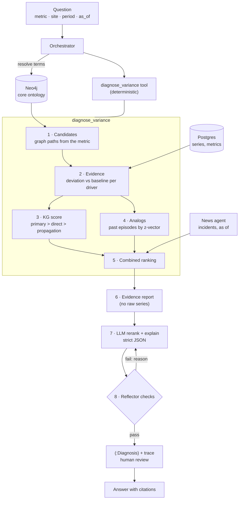
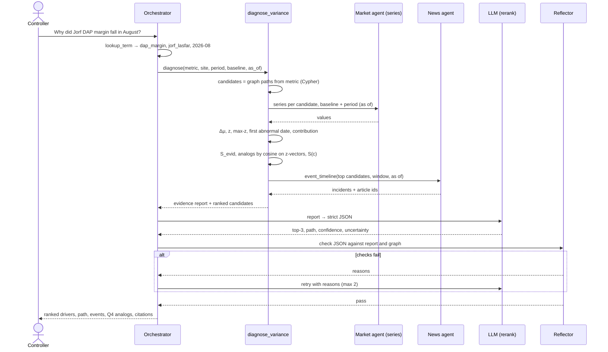

# Variance Diagnosis: Design Note

*2026-10-09. Status: prototype built (`src/variance.py`, `src/variance_tools.py`, `scripts/eval_variance.py`); see [Prototype results](#prototype-results). Answers the demo question of the [roadmap](03-roadmap.md):*

> "Pourquoi la marge DAP de Jorf a baissé en août, et que prévoir pour Q4 ?"

The design adapts a knowledge-graph-guided root-cause-analysis pipeline ([arXiv 2608.11277](https://arxiv.org/html/2608.11277), see [prior art §E](05-prior-art.md#e-root-cause-analysis-and-explanations)) from automotive test recordings to P&L drivers. Faulty sensor becomes moving driver; healthy reference run becomes baseline period; fault propagation through vehicle subsystems becomes propagation through `MADE_FROM` / `DEPENDS_ON` / `TRANSITS`.

An animated version of the architecture and agentic flow is in [media/variance-diagnosis.mp4](media/variance-diagnosis.mp4).

## Principle

The LLM is a **reranker and explainer**, not a diagnostician working from raw numbers. Everything that can be computed is computed before the LLM sees it: candidate drivers, deviations, scores, analogs. The LLM receives a compact evidence report and returns strict JSON. Deterministic checks then reject anything that is not in the evidence. This is the "LLM never computes numbers" rule, applied to explanation.

## Architecture



## Agentic flow



## Steps

### 0. Framing (orchestrator)
Resolve the words to a metric concept, a site, a period and a **baseline** (default: the three previous months; alternative: the same month last year). Set `as_of` = end of the period unless the user asks otherwise. Every later query is filtered on it ([prior art §C](05-prior-art.md#c-events--commodity-prices-methodology-warnings)).

### 1. Candidates (graph, deterministic)
Walk `DEPENDS_ON*` and `MADE_FROM*` from the metric, then `TRANSITS` to routes. Each reachable concept with a series becomes a candidate, tagged with its role and its path:

| Role | Meaning | Example for DAP margin |
|---|---|---|
| primary | a direct term of the metric | DAP price (Morocco fob), production cost |
| direct | one hop below a primary | ammonia, sulphur, phosphate rock |
| propagation | two hops or more, or reached through a route | sulphuric acid via sulphur; Hormuz via sulphur and ammonia |

The candidate set is closed. The LLM cannot name a driver outside it.

### 2. Evidence (deterministic, no LLM)
*As built, the reference is the last baseline month and the scale is the driver's volatility; see [what the evaluation changed](#what-the-evaluation-changed-in-the-design).*
For each candidate series *x* over the period window *W*, against the baseline *B*:

- raw deviation `Δμ = mean_W(x) − mean_B(x)`, in the series unit, with its sign;
- `z = |Δμ| / max(σ_B, ε)`, so drivers with different units can be compared (ε floors near-constant series);
- `max_z`: the largest single-week deviation in *W*, in z units;
- `first_abnormal`: the first date in *W* where the deviation exceeds `k·σ_B` (default k = 2). An early mover is more likely a cause than a late one;
- `contribution` (**attribution mode only**): when the path from the metric carries validated consumption ratios (e.g. t sulphur per t DAP on `MADE_FROM`), `ratio × Δμ` in $/t of product. Without validated ratios the tool runs in **signal mode** and ranks by z only. It says which mode it used.

Weekly windows inside the period are scored separately, then combined by rank voting (step 5).

### 3. KG score
*As built, the graph explains away rather than weighting roles; see [what the evaluation changed](#what-the-evaluation-changed-in-the-design).*
`S_evid(c) = w_p·S_p(c) + w_d·S_d(c) + w_g·S_g(c)`, with `S_*` the clipped abnormality score of the candidate's own series and of the series on its path, weighted by role (defaults w_p = 1.0, w_d = 0.7, w_g = 0.3). Propagation evidence can confirm a path but must not outrank a clear direct mover. Weights live in config. They are not tuned by the LLM.

### 4. Analogs (case retrieval)
A library of past episodes: every past month, summarised as the vector of z-scores over the same candidate set, plus what the metric did over the next 1 to 3 months (`FOLLOWED_BY_MOVE`, computed). Retrieve the top-k by cosine similarity on the z-vectors. The paper found that structured z-vectors retrieve better than raw values, text or sentence embeddings. Leakage rules:
- only episodes whose window ended before `as_of`;
- leave-one-period-out: the query period and its own weeks are never in the library or in the few-shot examples.

`S_ret(c)` = similarity-weighted share of analogs whose top driver was *c*.

### 5. Combined ranking
`S(c) = α·S_evid(c) + (1 − α)·S_ret(c)`, with α = 0.8 by default (the library starts small). Weekly rankings are aggregated by Borda count over their top-3.

### 6. Evidence report
A compact text block: framing, mode, the top candidates with their numbers and paths, the incidents from the news agent for those concepts in the window (with article ids), the analogs with their outcomes, and two or three few-shot examples (from other periods). No raw series.

### 7. LLM rerank and explain
Output schema:

```json
{
  "top1": "sulfur",
  "top3": [{"driver": "sulfur", "why": "...", "evidence": ["ev:sulfur:2026-08", "article:2795774"]}],
  "propagation_path": ["hormuz", "sulfur", "sulfuric_acid", "phosphoric_acid", "dap"],
  "confidence": "high | medium | low",
  "uncertainty": "...",
  "outlook_q4": [{"claim": "...", "evidence": ["analog:2022-03"]}]
}
```

The Q4 outlook is **only** what analogs and stored `Forecast` nodes support, labelled as such. The LLM does not forecast.

### 8. Reflector checks (deterministic)
1. JSON parses and matches the schema.
2. Every driver is in the candidate set.
3. `propagation_path` exists in the graph (one Cypher query per consecutive pair).
4. Every number in the text appears in the evidence report (the existing number check).
5. Every claim cites evidence ids that exist in the report.
6. **Agreement:** if the LLM's top-1 differs from the deterministic top-1, the answer says so and gives both. The difference is never hidden.
7. **Fidelity** (attribution mode): remove the top-1 driver's contribution from Δmetric. If the residual explains the variance as well as before, the top-1 driver was not the cause; flag it.

Failed checks go back to the LLM with the reasons (max 2 retries), as in the current agent loop.

### 9. Trace and review
`(:Diagnosis {metric, site, period, baseline, as_of, mode})-[:RANKED {rank, score, role}]->(:Concept)` and `-[:USED]->` every evidence node, series and article. A controller can approve or correct the ranking. Corrections become labelled episodes for the analog library and the evaluation.

## Evaluation: injected shocks
The paper evaluates on faults injected into a test bench, so the ground truth is known. We can do the same on market data, which gives labels without waiting for controllers:

1. Take a past month with no notable event.
2. Add a synthetic shock of known size and onset to one driver's series (and propagate it along a known path when testing propagation).
3. Run `diagnose_variance` and check whether the shocked driver is top-1 or in the top-3.
4. Report Top-1, Top-3 and MRR over many (driver, size, onset, month) combinations, leave-one-period-out.

Then a small set of real, labelled episodes: the 2026 Hormuz disruption (sulphur, ammonia), plus episodes controllers name. The paper's sample was 13 recordings; we should aim for hundreds of injected cases before quoting accuracy.

## What exists and what is missing

| Needed | Status |
|---|---|
| Metric concepts and `DEPENDS_ON` / `MADE_FROM` / `TRANSITS` | In `ontology.yaml` (illustrative, to validate) |
| Price series for DAP and inputs | Argus price assessments in the graph (`price_monthly`); `v_prices` in market-intel Postgres |
| Consumption ratios on `MADE_FROM` | **Missing.** Signal mode until industrial experts provide them |
| P&L actuals (the margin itself) | **Missing.** Prototype uses a market proxy: DAP fob minus input costs at fixed illustrative ratios, clearly labelled |
| Incidents as of a date | Built (news agent, `event_timeline`) |
| `FOLLOWED_BY_MOVE` | To compute (deterministic) |
| Reflector | Built for numbers and article ids; add checks 2, 3, 5, 6, 7 |

## Prototype results

### What was built
| File | What it does |
|---|---|
| `src/variance.py` | Pure functions: candidates from graph edges, evidence, scores, analogs, diagnosis, report, `check_answer`. No Neo4j needed |
| `src/variance_tools.py` | Agent tools `diagnose_variance` (report + JSON schema) and `submit_diagnosis` (checks, then `data/diagnoses/` for review); loads Argus series per `knowledge/driver_series.yaml` |
| `src/api.py` | `GET /variance?metric=gross_margin&product=dap&period=2026-08`: the deterministic part, no LLM |
| `scripts/eval_variance.py` | Injected-shock evaluation on a synthetic linked market (`--lag 1` for causes that started a month earlier), or on real series (`--graph`) |
| `tests/test_variance.py` | Unit tests (`python -m pytest tests`) |

### What the evaluation changed in the design
The first version followed steps 2 and 3 above literally and lost to a naive baseline (largest % change vs the previous month): 0.75 vs 0.92 top-1. Three changes fixed it:

1. **Reference level, not baseline mean.** Prices drift like random walks, so a move is measured from the last baseline month, scaled by the driver's own volatility (std of log returns between baseline observations). Comparing with the three-month mean counted ordinary drift as a shock.
2. **The graph explains away instead of weighting roles.** Fixed role weights (primary > direct > propagation) penalised real causes that sit far from the product. The graph is now used the way the paper uses propagation evidence: a downstream move is discounted when an upstream driver moved first, the same way, and at least as strongly. A falling input never explains a rising product.
3. **Two hypotheses per driver.** "Moved now" (scored on the month), and "moved in the previous month and is passing through", which counts only when downstream products move now in the same direction. This is what lets the tool answer the realistic question, where the cause started before the month asked about.

Weekly windows vote only when something in them is abnormal. Abnormality uses a log scale up to z = 30 instead of a hard cap at 6, which made a 30% jump tie with an ordinary move.

### Numbers (synthetic market, 3 seeds, 18 months, 6 drivers x 3 shock sizes x 2 onsets)
| Case | Method | Top-1 | Top-3 | MRR | Naive top-1 | Naive top-3 |
|---|---|---|---|---|---|---|
| Shock in the month diagnosed (648 cases) | full | 0.90 | 0.99 | 0.95 | 0.92 | 0.99 |
| Shock one month earlier, still passing through (416 well-posed cases) | full | 0.70 | 0.93 | 0.82 | 0.18 | 0.69 |

Read them carefully:
- When the cause moves inside the month, the method is **on par** with the naive baseline, not better. The value is in the second row: causes that started earlier and reach the product through the graph, which is the question controllers actually ask.
- **Analogs add nothing yet** (`no_analogs` scores the same). Their labels are the tool's own past top-1s; they need reviewed diagnoses before they can help.
- The synthetic market is a test bench with made-up pass-through coefficients and lags. Next: run `--graph` on the real Argus series, then build labelled real episodes (2026 Hormuz) with controllers.

## Running it on the real graph

```bash
python scripts/smoke_variance.py                    # 1 routes check, 2 eval on real series, 3 diagnosis report
python scripts/smoke_variance.py --period 2026-08 --ask   # + 4 the agent answers (calls the LLM)
python scripts/check_driver_series.py --write       # switch drivers whose configured route has little data to the best-covered one
```

`check_driver_series.py` prints, for every driver, the configured route with its number of assessments and months, and the best-covered routes for that product. Review the diff of `knowledge/driver_series.yaml` after `--write`.

## Review loop (UI tab "Variance")
- **Diagnose**: the deterministic ranking for a metric, product and month (`GET /variance`): moves, earlier moves still passing through, paths, analogs, incidents, and the drivers that have no series.
- **Review queue**: diagnoses the agent submitted (`data/diagnoses/`). A controller **approves** the model's top driver, **corrects** it (picks the true top driver from the ranking, with a note), or **rejects** it. API: `GET /diagnoses`, `GET /diagnoses/{name}`, `POST /diagnoses/{name}/review`.
- Approved and corrected months become **labelled analogs**: later diagnoses of the same metric and product use the reviewed top driver for those months instead of the tool's own top-1, and the report marks each analog `reviewed` or `automatic`. Rejected months fall back to the automatic label.

## Next
1. Attribution mode: validated consumption ratios on `MADE_FROM`, then the fidelity check (step 8.7).
2. `FOLLOWED_BY_MOVE` on incidents, so analogs can come from events as well as from months.
3. Once there are a few dozen reviewed months, re-run the evaluation with `alpha` < 1 to see whether analogs start to help.
