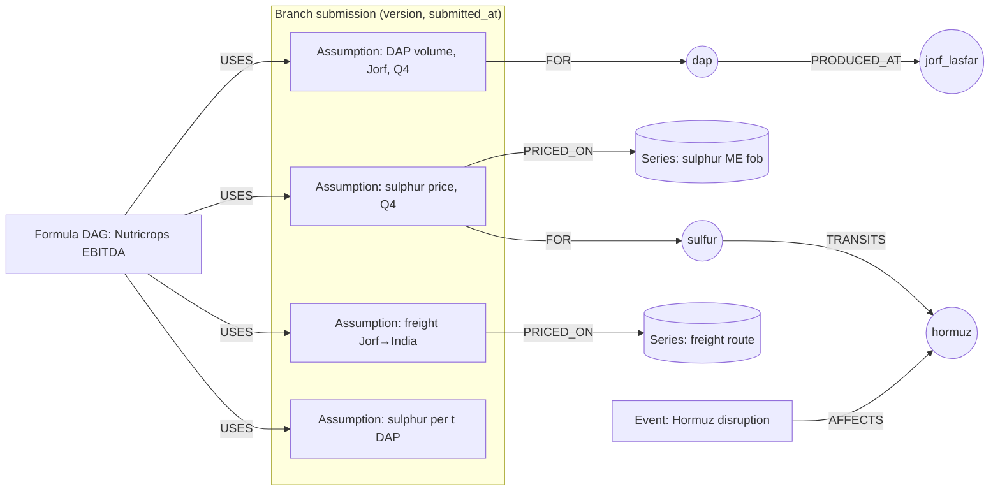

# P&L Agent: Living Forecasts on the Graph

*2026-10-09. Status: design. Builds on the [variance diagnosis](08-variance-diagnosis.md), the news / event agent and the review loop.*

## The problem, as OCP lives it

The group asks its branches for numbers: a budget, a rolling forecast, a landing estimate. Each branch answers with a detailed submission:
- volumes by product and site;
- sales prices and netbacks;
- consumption of rock, sulphur, ammonia and energy;
- input prices, freight, FX, fixed costs.

From the day it is sent, the submission ages. Sulphur triples, a strait closes, a plant stops, a tariff lands, and nothing tells the group which assumptions are now wrong, in which branch, or by how much.

This is not hypothetical. In H1 2026, sulphur prices roughly tripled while phosphate fertilizer prices rose about 20%, and OCP's EBITDA fell 28.5% ([Fertilizer Daily](https://www.fertilizerdaily.com/20260930-ocp-h1-2026-sulfur-costs-triple-as-ebitda-falls-28-5/md/), [Morocco World News](https://www.moroccoworldnews.com/2026/09/340166/ocp-holds-ebitda-margin-at-28-despite-global-phosphate-market-shock/)). Mosaic reported the same squeeze in Brazil: higher sulphur cut its Q4 2025 adjusted EBITDA, and it curtailed SSP output ([Zacks via Nasdaq](https://www.nasdaq.com/articles/zacks-industry-outlook-highlights:-nutrien-yara-international-mosaic-and-cf-industries), [Mosaic 10-K FY2024](https://www.sec.gov/Archives/edgar/data/1285785/000161803425000003/mos-20241231.htm)).

**The agent's job:** keep every branch submission marked to the market and to world events, say which assumptions an event touches and what it does to each branch's P&L and to the group, and explain every number. It never invents numbers: a deterministic engine computes, and the LLM reads, connects and explains.

## What other industries already do (and what we take)

| Practice | Where it comes from | What we take |
|---|---|---|
| **P&L explain / attribution.** Every day the desk's P&L is decomposed into the part explained by risk-factor moves (sensitivities × market moves), new deals, and an **unexplained** residual. Regulators test the fit (FRTB: Spearman correlation ≥ 0.80 green, < 0.70 red) | Bank and commodity trading desks ([arXiv 2309.07667](https://arxiv.org/pdf/2309.07667), [AcadiFi](https://acadifi.com/community/pnl-attribution-risk-theoretical-vs-actual)) | Mark each branch's plan to market every time prices or events move, and decompose the change by driver. The **unexplained share** is the health metric of our model: if it grows, a driver is missing from the graph |
| **Published sensitivities.** BHP discloses the EBITDA effect of a US$1 move in each commodity price (e.g. iron ore, copper, oil) | Mining ([BHP 20-F FY2021](https://www.sec.gov/Archives/edgar/data/811809/000119312521277719/d170194d20f.htm)) | A sensitivity table per branch and per driver, computed from the formula graph rather than kept by hand: "+$10/t sulphur = −X on Nutricrops Q4 EBITDA" |
| **Indicative margins from benchmark prices.** Refiners track margin indicators from benchmark product and crude prices times typical yields, not from the books | Refining (industry practice) | An indicative margin per product and site: DAP price − Σ consumption ratio × input price − freight. It runs daily, between closes. This is our `proxy_margin`, made official with validated ratios |
| **Ontology as a digital twin, with simulation.** The supply chain is modelled as objects and links, and scenarios are run against an enterprise goal. One consumer goods company built SKU-level COGS on 7 ERPs this way | Palantir Foundry ([digital twin](https://www.palantir.com/platforms/foundry/digital-twin/), [ontology](https://www.palantir.com/docs/foundry/ontology/overview), [supply chain](https://www.palantir.com/assets/xrfr7uokpv1b/1Ck5r0fJHcYaZSgV21tcXi/2fd9e681ed0641c134c4f9c99be93555/Palantir_Foundry_for_Supply_Chain_2022.pdf)). Independent view: a general platform rather than a planning engine ([Lokad](https://www.lokad.com/review-of-palantir-com/)) | Our Neo4j graph plays the ontology role. We keep the simulation **deterministic and auditable**, which a P&L needs |
| **Driver-based and agentic planning.** Plans are built from operational drivers (volumes, rates, capacity utilisation, logistics rates), and exogenous drivers (FX, tariffs) trigger recalculation | FP&A tools ([Pigment](https://www.pigment.com/blog/the-importance-of-driver-based-planning), [FP&A Trends](https://fpa-trends.com/article/how-move-static-budgets-agentic-planning), [SDG](https://www.sdggroup.com/en/the-future-of-planning-ai-driven-fpa-framework)) | Branch submissions are stored as drivers, not as P&L lines. Events re-trigger the calculation |
| **Knowledge graphs for shock propagation.** LLM + KG for causal reasoning about how risk spreads; dynamic financial KGs propagating signals across entities; event-driven forecasting with evidence hypergraphs | Research ([arXiv 2407.17190](https://arxiv.org/pdf/2407.17190), [2607.10932](https://arxiv.org/pdf/2607.10932), [2608.13024](https://arxiv.org/pdf/2608.13024)) | Use the graph to find **which assumptions** an event reaches (traversal), not to guess its size. Size comes from calibrated shocks and the formula engine |

## Core idea: the submission is a set of assumptions linked to the world



Every number a branch sends becomes an **Assumption** node: driver type, product or input, site, period, value, unit, and the branch's own source or comment. It links to:
- the **concepts** it concerns (`dap`, `sulfur`, `jorf_lasfar`);
- the **market series** it can be checked against (Argus sulphur Middle East fob, CRU ammonia, freight);
- the **formulas** that use it.

The graph already knows how concepts connect: `MADE_FROM`, `TRANSITS`, `PRODUCED_AT`, and supplier countries once the vessel tracker is loaded. So an event on any concept reaches the assumptions it can hurt by traversal, across every branch at once.

### Graph additions

| Node / edge | Meaning |
|---|---|
| `(:Submission {branch, cycle, version, submitted_at})-[:HAS]->(:Assumption)` | One branch answer, versioned. Nothing is overwritten (bitemporal: period = valid time, `submitted_at` = knowledge time) |
| `(:Assumption {driver, period, value, unit, basis})-[:FOR]->(:Concept)`, `-[:AT]->(site)` | Driver types: `volume`, `price`, `consumption_ratio`, `input_price`, `freight`, `fx`, `fixed_cost`, `transfer_price` |
| `(:Assumption)-[:PRICED_ON]->(:Series)` | The market reference to mark it against (provider series with `status: actual / forecast`) |
| `(:LineItem {name})-[:COMPUTED_BY]->(:Formula {expr, version})-[:USES]->(:Assumption)` | The P&L formula graph per branch; the consolidation rolls up through `PART_OF` and eliminates intercompany (rock sold by Mining to the chemical platforms at the transfer price) |
| `(:Scenario {name, calibrated_from})-[:SHOCKS {pct or abs, lag, duration}]->(:Concept)` | A shock template (e.g. "Hormuz closed 4 weeks") calibrated on analog incidents, not on LLM judgement |
| `(:Estimate {as_of, scenario, line, value, low, high})` | Every recomputation stored with its inputs, so any number can be traced and replayed |

## The engine (deterministic)

1. **Formula DAG evaluator.** P&L lines are formulas over drivers, versioned in YAML and loaded as `Formula` nodes. For example:
   - revenue = volume × netback;
   - netback = price − freight;
   - variable cost = volume × Σ(consumption ratio × input price);
   - transfer price on rock; FX.

   This is phase 5 of the [roadmap](03-roadmap.md).
2. **Sensitivities.** Finite differences on the DAG give ∂line / ∂driver for every branch: the BHP-style table, computed rather than maintained by hand.
3. **Mark-to-market.** Re-value each submission with today's market series in place of the branch's price assumptions. Volumes stay as submitted unless an event touches them. The difference is the "market-implied change" since submission.
4. **Attribution (P&L explain).** Decompose any change (plan v1→v2, plan→market-implied, plan→actual) by driver with **Shapley values**: an order-independent split, exact for the ~10 drivers of a branch. The residual not explained by modelled drivers is reported, never hidden.
5. **Scenarios with ranges.** An event maps to a scenario template whose shock sizes come from analogs (past incidents and the price moves that followed: `FOLLOWED_BY_MOVE`, see the variance design). Monte Carlo over the analog distribution gives a range, not a single number.

## The agents

| Agent | Job | Writes |
|---|---|---|
| **Intake** | Reads branch templates (Excel, through specs with anchors) into Submission / Assumption nodes. Checks completeness, units, periods, and consistency with the asset graph (volume ≤ capacity × operating rate; consumption ratios within plant norms) | Submissions (to review) |
| **Challenger** | Compares each assumption with its market reference and recent analogs. Flags the ones outside a band, stale since a known event, or inconsistent across branches (two branches assuming different sulphur prices for the same month) | Flags, questions to branches |
| **Watcher** (continuous) | Listens to the news / event agent and price feeds. On a new incident, traverses the graph from the affected concepts to the exposed assumptions in every branch, and asks the engine for the impact with sensitivities and the matching scenario | Alerts, proposed revisions |
| **Explainer** | Writes bridges (v1→v2, plan→market, plan→actual) from the attribution, with citations to series, incidents and submissions. The [variance diagnosis](08-variance-diagnosis.md) is its tool for actuals | Narratives |
| **Orchestrator** | Answers the group's questions ("what does Hormuz do to Q4 EBITDA, by branch?"), runs the cycle, routes reviews | none |
| **Calculator** | **Not an LLM.** The formula engine above | Estimates |

## Agentic flow: one event

```mermaid
sequenceDiagram
    participant N as News / event agent
    participant W as Watcher
    participant G as Graph
    participant C as Calculator
    participant X as Explainer + Reflector
    participant B as Branch controller
    participant H as Group finance

    N->>W: Incident: Hormuz shipping disrupted (articles, date)
    W->>G: Concepts affected → TRANSITS ← sulphur, ammonia, urea
    G-->>W: Exposed assumptions: Nutricrops Jorf sulphur Q4, ammonia Q4, freight Gulf legs
    W->>C: Scenario "Hormuz 4 weeks" (shocks calibrated on analogs) on those assumptions
    C-->>W: Impact per branch and line, range (p10–p90), attribution
    W->>X: Draft alert
    X-->>W: Checked: numbers from the calculator, citations present
    W->>B: "Your Q4 sulphur assumption is now X below market; est. impact Y (range)"
    B-->>W: Confirm, revise, or justify (contract price, inventory cover)
    W->>H: Group view: impact by branch, consolidated, with what was confirmed
```

Branch replies matter. A branch may be hedged, hold inventory, or have a contract price. Those facts become assumption attributes (`basis: contract`, `cover_weeks: 6`), so the next event is computed correctly. This is how the graph learns what the market data cannot show.

## What the group gets

- **A living landing estimate**: each branch's submission next to its market-implied version, with the gap explained by driver.
- **Event impact in minutes**: "Hormuz: −X to −Y on Q4 EBITDA, 70% Nutricrops Jorf sulphur, 20% ammonia, 10% freight", every number traceable to a series, an incident and a submission.
- **A challenge list before the review meeting**: assumptions far from market, stale since an event, or inconsistent between branches.
- **Sensitivity tables per branch**, refreshed every cycle.
- **Model health**: the unexplained share of each bridge, the P&L-explain quality test of the trading desks.

## What we need from OCP
1. The branch submission templates (one per branch), for the Intake specs.
2. The P&L structure per branch (lines, formulas) and the consolidation rules, including transfer prices.
3. Validated consumption ratios per plant (they also unlock attribution mode in the variance diagnosis).
4. Which market reference each assumption should be marked against, and hedging / contract practice by input.
5. Who reviews what: branch controllers, group FP&A.

## Prototype plan
1. `knowledge/pnl_model.yaml`: an illustrative formula graph for Nutricrops DAP at Jorf (revenue, variable costs from rock / sulphur / ammonia, freight), clearly marked illustrative until OCP provides the real one.
2. `src/pnl.py`: DAG evaluator, sensitivities, Shapley attribution, mark-to-market against provider series (actuals only), with tests.
3. A synthetic branch submission, then the Watcher flow end to end on a Hormuz-like incident: exposure by traversal, impact with range, alert text checked by the Reflector.
4. UI tab: submission vs market-implied, bridge, challenge list.
