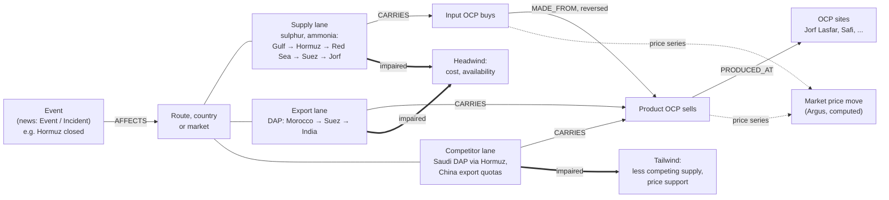

# From world events to OCP: the exposure walk

Question this answers: *"OCP lost a lot this year, why?"*, *"what hit OCP in 2026?"*, *"how exposed is DAP to the Red Sea?"*

The agent cannot answer the first question with a number: the graph holds no OCP results, volumes or costs. What it can do is
walk, on the graph, from each event to OCP: which route or country was hit, what OCP buys or sells through it, which OCP
products and sites need that, and how the market price moved. That is the "why", with evidence. The "how much" needs OCP data
(see "What it needs from OCP").

## The chain



The same event often lands on both sides. A Hormuz closure cuts Gulf sulphur and ammonia (OCP's cost goes up) **and** takes
Saudi (Ma'aden) DAP off the market (the price OCP gets goes up). The tool shows both and does not net them: netting needs volumes.

## Effect rules (deterministic, in `src/exposure.py`)

| Link | What happened | Effect for OCP |
|---|---|---|
| supply lane (OCP buys) | origin or route disrupted / down | headwind: availability, input cost |
| export lane (OCP sells) | route disrupted, market closed, duties | headwind: sales delayed or costlier |
| competitor lane | competitor's origin or route disrupted, export restriction | tailwind: price support |
| input market (event on the input itself) | price up / supply tighter | headwind |
| product market (event on OCP's product) | price up | tailwind |
| OCP site | outage, strike, accident | headwind on what the site makes |

The event's direction comes from the news extraction (`AFFECTS {direction, channel}`); when reports disagree the most frequent
direction wins.

## What is in the graph

- `knowledge/ontology.yaml`: products, inputs, MADE_FROM recipes, OCP sites, and the routes (Hormuz, Bab el-Mandeb / Red Sea,
  Suez, Cape of Good Hope, Turkish Straits). Route names are also Terms, so news articles link to them.
- `knowledge/supply_chain.yaml` → `(:Lane)` nodes (`src/load_supply_chain.py`): 20 lanes, supply, export and competitor.
  **All are public knowledge, not confirmed by OCP** (`status: public`, `share: null`). The tool says so on every link.
- Events and incidents from the news extraction; price series from `knowledge/driver_series.yaml`.

## Running it

```bash
python src/load_supply_chain.py --check    # validate the lanes file
python src/load_supply_chain.py            # after load_knowledge.py and import_referentials.py (load_all.sh does it)
python src/news_extract.py load            # re-link events: the new route terms (Red Sea, Suez, ...) now resolve
```

Then ask the agent "OCP a beaucoup perdu cette année, pourquoi ?". It calls `ocp_exposure("", "2026-01-01", today)`, says
first that it cannot size the loss, and answers with headwinds, tailwinds and what it cannot say.

Tested: `tests/test_exposure.py` (real ontology and lanes, made-up events); the Cypher was run on an in-process Neo4j 5.26 with
the ontology, lanes, fake events and prices.

## What it needs from OCP

1. **Procurement:** for sulphur and ammonia, the real origins and shares (and routes), to turn `status: public` lanes into
   `confirmed` ones and drop the wrong ones.
2. **Sales:** export markets and shares per product.
3. **Finance:** monthly volumes and results per product or branch. With these, the P&L engine (`src/pnl.py`) can size each
   headwind and tailwind in $ and net them (Shapley bridge), and the answer becomes "lost X, of which Y from sulphur via Hormuz".
4. **Input ratios** (t of sulphur, ammonia, rock per t of product) to replace the illustrative ones in `driver_series.yaml`.
